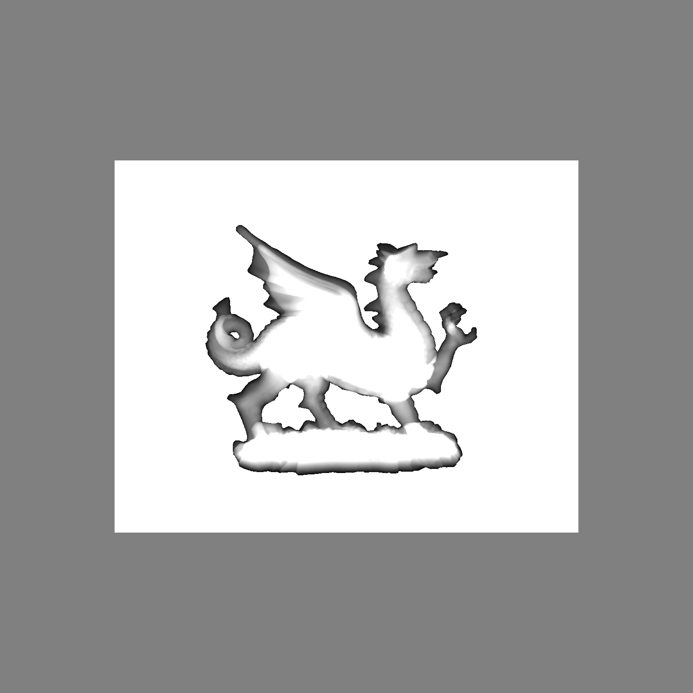

    ---
Original Author: Dr Franck P. Vidal  
Institute: School of Computer Science and Electronic Engineering, Bangor University, UK  
Title: ICE4131 -- High Performance Computing  
Subtitle: A Simple ray tracer to parallelise using PThread, OpenMP, MPI and CUDA.  
---
 

# SimpleRayTracing

Originally used as an example of application for Dr. Franck P. Vidal's HPC module. The code here has been forked to be modified as a software implementation of X-ray attenuation on the CPU as a part of my MSc thesis.

## Test Log

This section demonstrates some images created during testing.

At the moment, I have made some modifications to remove the dragon and changed the way distance is used to set the shade. The x-ray source is now in the same position as the source.

Progress made, now using L-buffer to produce the following image.

